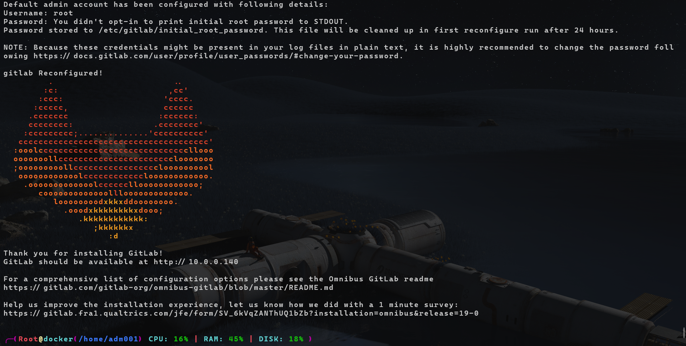

# 🦊 GitLab with 🐳Docker Registry

Git repo + Docker Image registry
Here are the complete steps to install GitLab on Debian, configured specifically for **minimal RAM usage** while keeping the **Git repository** and **Docker Container Registry** fully functional.

Since we want the Docker Registry accessible on a specific custom port (`http://10.0.0.140:7080`), the configuration below maps the bundled Nginx server to listen on port `7080` exclusively for the registry.

### Step 1: Install GitLab CE (Community Edition)
Run the following commands on your Debian server to install the lightweight Community Edition package.

```bash
# 1. Install dependencies
sudo apt-get update
sudo apt-get install -y curl openssh-server ca-certificates tzdata perl

# 2. Add the GitLab CE package repository
curl -sS https://packages.gitlab.com/install/repositories/gitlab/gitlab-ce/script.deb.sh | sudo bash

# 3. Install GitLab CE (Set the external URL to your server's IP)
sudo EXTERNAL_URL="http://10.0.0.140" apt-get install gitlab-ce
```

### Step 2: Open Firewall Ports
Since you are using a custom port (`7080`) for the Docker Registry, you must ensure your server's firewall allows traffic to it, as well as standard web and SSH ports.

```bash
sudo ufw allow 80/tcp    # GitLab Web UI
sudo ufw allow 22/tcp    # Git (SSH push/pull)
sudo ufw allow 7080/tcp  # Docker Registry
sudo ufw reload
```
*(If you use `iptables` instead of `ufw`, use: `sudo iptables -A INPUT -p tcp --dport 7080 -j ACCEPT`)*

---

### Step 3: Apply the Minimal `gitlab.rb` Configuration
This configuration disables all heavy monitoring, chat, and pages services (saving ~400MB+ of RAM) and optimizes the web server and background workers to use the absolute minimum memory required to run Git and the Registry.

Open the configuration file:
```bash
sudo nano /etc/gitlab/gitlab.rb
```

Scroll to the bottom of the file and append the following minimal configuration block:

```ruby
# --- 1. Define External URLs ---
external_url 'http://10.0.0.140'
registry_external_url 'http://10.0.0.140:7080'

# --- 2. Explicitly Enable Registry Features ---
registry['enable'] = true
gitlab_rails['registry_enabled'] = true

# --- 3. Disable Heavy / Unneeded Services (Saves 400MB+ RAM) ---
# Note: mattermost, pages, and grafana are completely removed in modern 
# GitLab versions and do not need to be disabled.
gitlab_pages['enable'] = false
prometheus_monitoring['enable'] = false
prometheus['enable'] = false
alertmanager['enable'] = false
node_exporter['enable'] = false
redis_exporter['enable'] = false
postgres_exporter['enable'] = false
puma['exporter_enabled'] = false
gitlab_exporter['enable'] = false

# --- 4. Optimize Puma (Web Server) ---
puma['worker_processes'] = 0
puma['min_threads'] = 1
puma['max_threads'] = 2

# --- 5. Optimize Sidekiq (Background Jobs) ---
sidekiq['max_concurrency'] = 10

# --- 6. Force Memory Return to OS (Prevents Memory Hoarding) ---
gitlab_rails['env'] = { 'MALLOC_CONF' => 'dirty_decay_ms:1000,muzzy_decay_ms:1000' }
gitaly['env'] = { 'MALLOC_CONF' => 'dirty_decay_ms:1000,muzzy_decay_ms:1000' }

# --- 7. Limit PostgreSQL Memory (Optional) ---
postgresql['shared_buffers'] = "256MB"
```

Save and exit the file (`Ctrl+O`, `Enter`, `Ctrl+X`).

---

### Step 4: Reconfigure and Get Password
Apply your new minimal settings and retrieve the initial root password.

```bash
# Apply the minimal configuration (this may take a few minutes)
sudo gitlab-ctl reconfigure

# Restart services to ensure everything is running lean
sudo gitlab-ctl restart

# Get the initial root password (valid for 24 hours)
sudo cat /etc/gitlab/initial_root_password
```

You can now log into the GitLab Web UI at `http://10.0.0.140` using the username `root` and the password from the command above.

---

### Step 5: Configure Client Machines for Docker Registry
Because you are using **HTTP** (not HTTPS) for the registry at `http://10.0.0.140:7080`, Docker on your client machines will block the connection by default for security reasons. You must tell Docker to treat this IP and port as an "insecure registry."

**On every computer/server that will push/pull images:**

1. Edit (or create) the Docker daemon configuration file:
   ```bash
   sudo nano /etc/docker/daemon.json
   ```
2. Add your registry IP and port to the insecure-registries list:
   ```json
   {
     "insecure-registries" : ["10.0.0.140:7080"]
   }
   ```
3. Restart Docker on the client machine:
   ```bash
   sudo systemctl restart docker
   ```

**Testing the Registry:**
Once the daemon is restarted, you can log in and push your first image from your client machine:

```bash
# Log in (use your GitLab username/password, or a Deploy Token)
docker login 10.0.0.140:7080 -u root

# Build and push an image
docker build -t 10.0.0.140:7080/your-group/your-project:latest .
docker push 10.0.0.140:7080/your-group/your-project:latest
```
